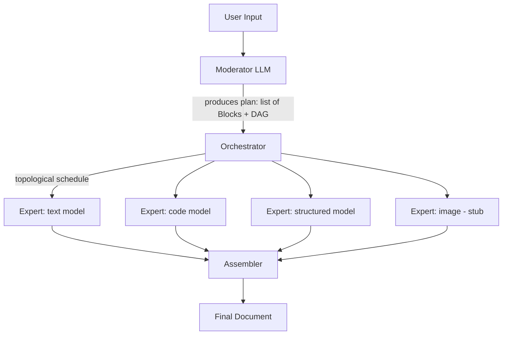

# Plan: Moderated Cooperating Experts (MoCE) — Multi-LLM Orchestration

## Novelty note
Architecture is a "planner + typed-block specialist executors" multi-agent system.
Overlaps with Mixture-of-Agents / AutoGen supervisor pattern / HuggingGPT. Not a new
algorithm, but a reasonable engineering combination; the block-DAG + strict no-derail
output constraint + local transformers-based expert-per-block-type design is the
differentiator.

## Stack decisions
- Python, hand-rolled orchestration (no LangGraph/AutoGen dependency)
- Models loaded directly via HuggingFace `transformers` (not Ollama/llama.cpp) so
  later fine-tuning (LoRA/PEFT) and internals access (hidden states, logits) remain possible
- Each block TYPE gets a distinct local model (e.g., code-tuned model for `code`
  blocks, general model for `text`, etc.)
- Block types v1: `text`, `code`, `structured` (JSON). `image` block type exists in
  schema but generation is stubbed (`NotImplementedError`)
- Parallel execution respecting a dependency DAG between blocks
- Interface: CLI tool

## Architecture Overview

## Modules (implemented)
- [moce/schema.py](moce/schema.py) — `Block`, `Plan`, `BlockResult` Pydantic models,
  plus the JSON schema hint shown to the moderator LLM
- [moce/dag.py](moce/dag.py) — DAG construction/validation and topological
  generation scheduling (via `networkx`)
- [moce/model_manager.py](moce/model_manager.py) — YAML-configured, lazily-loaded,
  LRU-cached `transformers` model wrapper exposing `generate(role, system_prompt, user_prompt)`
- [moce/moderator.py](moce/moderator.py) — prompts the moderator model for a JSON
  `Plan`, validates + retries with corrective feedback on failure
- [moce/experts.py](moce/experts.py) — per-block-type system prompts, dependency
  placeholder substitution, output validation (code/JSON/text) with retry-on-invalid
- [moce/orchestrator.py](moce/orchestrator.py) — runs blocks generation-by-generation
  per the DAG, optionally concurrently via `ThreadPoolExecutor`
- [moce/assembler.py](moce/assembler.py) — fills the plan's assembly template with
  each block's validated output (or an inline error marker on failure)
- [moce/cli.py](moce/cli.py) — `click`-based CLI (`moce run "<prompt>"`, `--verbose`,
  `--dry-run`, `--config`, `--max-workers`)
- [configs/models.yaml](configs/models.yaml) — example model config (small Qwen2.5
  models per role; swap `model_id` for any compatible model)
- [tests/](tests) — unit tests for schema/DAG, experts (validation/retry), moderator
  (plan generation/retry), and orchestrator+assembler, all using scripted/mocked
  generators (no real model downloads required)

## Verification
1. `pytest tests/` — schema validation, DAG cycle detection, retry logic (mocked models)
2. `moce run "..." --dry-run` — confirms moderator produces a valid plan without
   running any experts
3. `moce run "..." --verbose` end-to-end with real local models — confirms each
   expert output contains ONLY the requested content type
4. Cyclic-dependency plan (unit test) — confirms a clear `DagError` rather than a hang

## Key decisions
- Image generation is schema-supported but stubbed (`NotImplementedError`) in v1
- Different physical model per block type (not one model + different system prompts)
- Orchestration is hand-rolled (`networkx` for DAG only), not LangGraph/AutoGen

## Further considerations / known limitations
1. **VRAM contention**: "parallel" block execution may still serialize model loads
   if VRAM can't hold all needed experts simultaneously. Start with small models
   (≤1.5B params) and `max_loaded_models: 2-3`; consider 4-bit quantization
   (bitsandbytes) if running many/larger models on one GPU.
2. **Retry loops**: capped at a configurable `max_retries` (default 3); a block
   that never produces valid output is marked `invalid` and surfaced inline as
   `[ERROR: block 'x' failed validation: ...]` in the final document rather than
   crashing the whole run.
3. **Code validation** only syntax-checks Python (via `ast.parse`) in v1; other
   languages pass through without a syntax check.
4. **Image blocks** are stubbed; wiring up a local diffusion pipeline (e.g. via
   `diffusers`) is a natural v2 addition using the same `role -> model config`
   pattern already in `model_manager.py`.

## Next steps (not yet implemented)
- Install dependencies and run `pytest` to confirm the test suite passes
- Try `moce run "..." --dry-run` with a real moderator model to validate prompting
- Add a LoRA/PEFT fine-tuning script per expert role once real usage data exists
- Optionally wire an image-generation backend (e.g. `diffusers` + Stable Diffusion)
