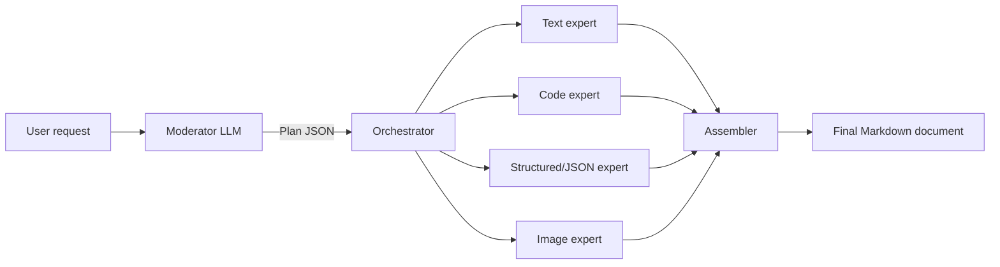

# MoCE: How It Works

This document explains how the Moderated Cooperating Experts (MoCE)
pipeline operates end to end, and documents the real-world failure modes
that were found while running it against actual small local models, and
how each was addressed. For the original design goals, see [PLAN.md](PLAN.md).

## 1. Overview

MoCE answers a single user request by splitting the work across multiple
small, specialized LLMs instead of asking one model to do everything:



1. The **moderator** reads the user's request and produces a `Plan`: a set
   of typed **blocks** (`text`, `code`, `structured`, `image`), each with
   its own prompt for a specialist, an optional list of block ids it
   `depends_on`, and an `assembly_template` describing how the final
   document is stitched together.
2. The **orchestrator** executes blocks in dependency order (a DAG), running
   independent blocks within the same "generation" concurrently if
   `--max-workers` allows it.
3. Each block is handed to the matching **expert**: a small model prompted
   with a strict, type-specific system prompt ("output ONLY code", "output
   ONLY JSON", etc.), plus the block's own prompt with any dependencies'
   outputs substituted in.
4. Expert output is **validated** (JSON parses, code is extracted from
   stray fences, boilerplate prose stripped) and retried (up to
   `DEFAULT_MAX_RETRIES`) if invalid.
5. The **assembler** substitutes each block's validated output into the
   `assembly_template`'s `{{output_slot}}` placeholders, wrapping `code`
   blocks in fenced ` ```language ` blocks and `structured` blocks in
   ` ```json ` blocks, producing the final Markdown document.

## 2. Module map

| Module | Responsibility |
| --- | --- |
| `moce/schema.py` | Pydantic models (`Block`, `Plan`, `BlockResult`) and the JSON schema/example text shown to the moderator model. |
| `moce/moderator.py` | Prompts the moderator LLM for a `Plan`, parses/repairs its JSON output, normalizes common mistakes, validates against the schema and the dependency DAG, retries on failure. |
| `moce/dag.py` | Builds a dependency graph from a `Plan`, validates it's acyclic, and computes topological "generations" (batches of blocks that can run in parallel). |
| `moce/experts.py` | Per-block-type system prompts, dependency substitution, output validation/cleanup, and the retry loop for running a single block. |
| `moce/orchestrator.py` | Runs an entire `Plan`: iterates generations, optionally uses a thread pool for blocks within the same generation. |
| `moce/assembler.py` | Fills the `assembly_template` with each block's validated output, applying Markdown fencing per block type. |
| `moce/model_manager.py` | Loads/caches HuggingFace `transformers` models and `diffusers` pipelines per role, with an LRU cache bounding how many stay resident on the GPU; also configures third-party logging noise suppression. |
| `moce/cli.py` | `click`-based CLI (`moce run "..."`) wiring everything together, plus diagnostics flags. |

## 3. The Plan: schema and prompt design

The moderator is a single LLM call constrained to emit **one JSON object**
matching:

```json
{
  "blocks": [
    {
      "id": "code1",
      "type": "code",
      "depends_on": [],
      "prompt": "Write a Python function that reverses a string.",
      "output_slot": "code_slot",
      "language": "python"
    },
    {
      "id": "text1",
      "type": "text",
      "depends_on": ["code1"],
      "prompt": "Explain what this code does: {{code1.output}}",
      "output_slot": "text_slot"
    }
  ],
  "assembly_template": "```python\n{{code_slot}}\n```\n\n{{text_slot}}"
}
```

Key rules encoded in `MODERATOR_SYSTEM_PROMPT`:
- Code and its explanation must be **separate blocks** — a "code" block's
  output must be pure code, never prose; a dependent "text" block explains
  it, referencing the code via `{{block_id.output}}`.
- Every `depends_on` relationship must be **mirrored** in the dependent
  block's `prompt` text as a literal `{{block_id.output}}` placeholder.
- For requests with multiple similar items (e.g. "N languages, each with
  code + a description"), the moderator must emit one `code` + one
  dependent `text` block **per item**, and each `text` block's prompt must
  identify which specific item it covers and avoid re-introducing shared
  background — otherwise near-duplicate prose appears once per item.
- The top-level response must be a JSON *object* (never a bare array) and
  contain nothing but that JSON.

## 4. Expert execution and validation

Each block type has a dedicated system prompt in `experts.py` reinforcing
"no extra commentary, only the requested content." Beyond prompting,
`run_block()` performs type-specific **post-validation**, because small
instruction-tuned models (0.5B–3B) reliably violate formatting constraints
under prompting alone:

- **code**: `_extract_code()` looks for a matched ` ```lang ... ``` ` fence
  and keeps only its contents; if there's no matched pair but a single
  stray/unpaired fence exists, only the text before it is kept (handles
  models that emit raw code followed by a lone closing fence and then a
  prose explanation). The result is syntax-checked with `ast.parse()` only
  when the block's `language` is Python (or unset) — non-Python languages
  skip the check entirely rather than misleadingly logging "not valid
  Python" on every run.
- **structured**: fenced code blocks are stripped, then the remainder is
  parsed as JSON and re-serialized (`json.loads` → `json.dumps`), raising
  and retrying on parse failure.
- **text**: a regex strips common boilerplate prefixes ("Sure, here's...",
  "Certainly...", etc.).
- **image**: delegates to `ModelManager.generate_image()` (a `diffusers`
  text-to-image pipeline), saving the file and returning a Markdown image
  reference; failures are caught and reported as an invalid block rather
  than raising.

Invalid results are retried up to `DEFAULT_MAX_RETRIES` times with a
corrective follow-up prompt describing the validation error.

### Dependency substitution

`_substitute_dependencies()` replaces every `{{block_id.output}}` in a
block's prompt with that dependency's validated output. As a safety net,
`_append_missing_dependency_outputs()` also appends any declared
dependency's output that isn't referenced via a placeholder, so a model
that lists `depends_on` correctly but forgets the placeholder text still
gets the actual content to act on.

## 5. Orchestration and concurrency

`dag.py` groups blocks into **topological generations**: batches of blocks
whose dependencies are all satisfied by prior generations. `orchestrator.py`
runs each generation's blocks either sequentially or via a
`ThreadPoolExecutor` (`max_workers`). Concurrency is real but bounded:
- Blocks in *different* generations always run sequentially (later ones
  need earlier ones' output).
- Blocks in the *same* generation can run concurrently, up to
  `max_workers`.
- Real throughput is also capped by `ModelManager`'s LRU model cache
  (`max_loaded_models` in `configs/models.yaml`) — a single consumer GPU
  can typically only keep 1-2 models resident, so concurrent blocks
  requiring different models may still serialize on load/eviction.

## 6. Assembly

`assemble()` walks the `assembly_template` and replaces each
`{{output_slot}}` (or, as a fallback, `{{block_id}}`/`{{block_id.suffix}}`)
with the corresponding block's validated output, wrapping `code` blocks in
` ```<language> ` fences and `structured` blocks in ` ```json ` fences so
the final document renders as clean Markdown.

## 7. Diagnostics

Two orthogonal concerns are deliberately kept separate:
- **`--debug`**: diagnoses *this project's* logic — logs the moderator's
  raw output, each block's raw (pre-validation) output, and retry counts.
- **`--show-model-noise`**: un-suppresses third-party library logging
  (`transformers`, `huggingface_hub`, `diffusers`, `accelerate`,
  `safetensors`, `httpx`/`httpcore`/`requests`, `urllib3`, `filelock`),
  which is otherwise silenced (via env vars, logger levels, `.disabled`,
  and each library's own verbosity/progress-bar toggles) because it's
  extremely chatty and rarely relevant to debugging pipeline logic.

Combining both flags surfaces third-party logs at INFO level — `--debug`
never escalates them to DEBUG, since that produced an unreadable wall of
unrelated library trace output in practice.

## 8. Failure modes found in practice, and fixes

Running the pipeline against real small local models (Qwen2.5 family,
0.5B-3B) surfaced a series of concrete failures beyond what prompting
alone could reliably prevent. Each was fixed with a combination of
strengthened prompts (first line of defense) and defensive data-layer
normalization/extraction (safety net, since prompting alone repeatedly
proved insufficient for models this size):

| Symptom | Root cause | Fix |
| --- | --- | --- |
| Moderator's JSON truncated mid-string ("Unterminated string...") | `max_new_tokens` too small for larger plans (many blocks) | Bumped moderator's `max_new_tokens` to 1536; `_parse_json_object()` also tolerates trailing "Extra data" via `json.JSONDecoder().raw_decode()`. |
| `AttributeError: 'list' object has no attribute 'get'` | Moderator emitted a bare JSON array instead of the required `{"blocks": ..., "assembly_template": ...}` object | `_normalize_top_level_shape()` wraps a bare list into the expected object shape, synthesizing an `assembly_template`. |
| Code blocks contained trailing prose describing the code | Small models default to "code + explanation" chat patterns despite explicit instructions not to | Strengthened code/moderator system prompts (necessary but insufficient alone); added `_extract_code()` fence-based extraction as a deterministic safety net. |
| `code block is not valid Python` logged for non-Python code | `_validate_code()` always ran `ast.parse()` regardless of the block's actual language | Syntax-check is now skipped unless `language` is unset or explicitly Python. |
| `--debug` output "hardly usable" / overwhelming | Third-party logger verbosity was tied to `--debug` when combined with `--show-model-noise` | Decoupled entirely: `--debug` never affects third-party logger levels; `--show-model-noise` caps them at INFO. |
| Stray `httpcore`/`httpx` DEBUG logs still leaking through | Those loggers weren't in the suppression list | Added `httpcore`, `httpx`, `requests` to `_NOISY_LOGGERS`. |
| Text block responded "I'm sorry, but you haven't provided any code..." | The block's `depends_on` was set, but its `prompt` text never actually included the `{{block_id.output}}` placeholder, so no code reached the expert | Added `_append_missing_dependency_outputs()` in `experts.py` (runtime safety net) **and** `_ensure_dependency_references()` in `moderator.py` (fixes the `Plan` data itself, so the placeholder is always present in the stored/printed plan, not just injected at generation time). |
| Multiple similar text sections (e.g. one description per language) repeated shared context/overlapped | Moderator didn't instruct each text block to treat itself as one section of a larger document | Strengthened `MODERATOR_SYSTEM_PROMPT` and the `text` expert system prompt to require each text block to name its specific item and avoid restating shared background covered by sibling blocks. |

## 9. Lessons learned

Small (0.5B-3B) instruction-tuned models reliably violate formatting
constraints that a larger model would follow from prompting alone —
mixing prose into code, emitting bare arrays instead of objects, dropping
placeholder references despite listing a dependency, adding
unsolicited preamble/commentary. The pattern that worked across every
issue in this project: **strengthen the prompt first** (cheap, sometimes
sufficient, always worth doing), but when repeated real-world testing
shows it isn't reliably followed, **add a deterministic, defensive
normalization/extraction step in code** rather than relying on further
prompt tuning alone. Every fix above ends up defense-in-depth: a stronger
prompt plus a code-level guarantee that doesn't depend on the model's
instruction-following ability.
